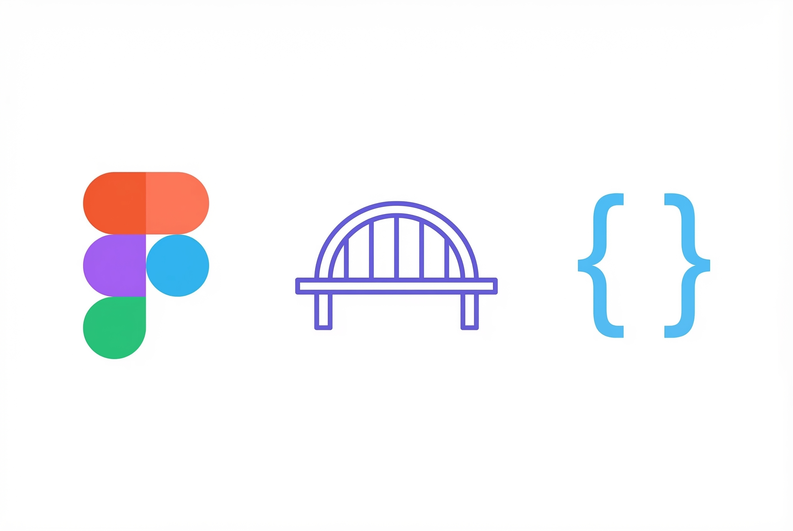
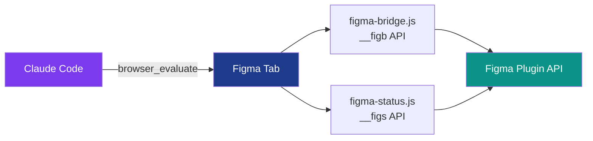

<p align="center">
  
</p>

# Figma Bridge

> A Chrome extension that auto-injects helper functions into Figma, enabling Claude Code to design directly in Figma through browser automation.

Figma Bridge exposes a concise JavaScript API (`__figb.*`) on every Figma page, letting AI agents create frames, text, shapes, components, images, and effects — all without a Figma plugin. A companion status panel (`__figs.*`) provides real-time visual feedback on active agents.

## Features

- **Node creation** — frames, rectangles, ellipses, lines, polygons, stars, components, and text (including rich/mixed-style text)
- **Image support** — load images from URL, create image-filled frames with automatic gradient fallback
- **Color utilities** — hex, RGB, RGBA converters plus linear, radial, and angular gradient builders
- **Effects** — drop shadows, inner shadows, layer blur, background blur (glassmorphism)
- **Style management** — create reusable paint styles, text styles, and effect styles
- **SVG icons** — insert and recursively recolor SVG icon nodes
- **Navigation** — find nodes by name/type, switch pages, zoom, and select
- **Design verification** — detect overlapping frames, default-named nodes, empty text, and tiny elements
- **Status panel** — persistent in-canvas panel showing connected agents and their progress

## Architecture



The extension injects two content scripts into `figma.com` pages via Manifest V3:

| Script | Global | Purpose |
|--------|--------|---------|
| `figma-bridge.js` | `__figb` | Node creation, colors, effects, navigation, verification |
| `figma-status.js` | `__figs` | Agent status panel — init, update, done, remove |

## Quick Start

### Prerequisites

- Google Chrome (or Chromium-based browser)
- A Figma account with an open design file

### Installation

1. Clone the repository:
   ```bash
   git clone https://github.com/lukaskellerstein/figma-bridge.git
   ```
2. Open `chrome://extensions` in Chrome
3. Enable **Developer mode** (toggle in top-right)
4. Click **Load unpacked** and select the cloned `figma-bridge/` directory
5. Open any Figma design file — the bridge injects automatically

### Verify

Open the browser console on a Figma page and run:

```js
__figb.version  // → "1.9.0"
```

## Usage

All helpers are available on `window.__figb` after the extension loads. Scripts are designed to be injected via `mcp__design-playwright__browser_evaluate` from Claude Code.

### Create a card with text

```js
const card = __figb.frame('Card', {
  w: 320, h: 200, direction: 'VERTICAL',
  p: 16, gap: 12, fill: __figb.hex('#FFFFFF'), radius: 12,
  effects: __figb.shadowLg(),
});

await __figb.txt('Hello World', {
  size: 24, style: 'Bold', fill: __figb.hex('#111827'), parent: card,
});
```

### Insert an image

```js
const hash = await __figb.loadImage('https://example.com/photo.jpg');
const hero = __figb.frame('Hero', {
  w: 1440, h: 400, image: hash, parent: container,
});
```

### Rich text with mixed styles

```js
await __figb.richTxt([
  { text: 'Bold intro ', style: 'Bold', size: 18, hex: '#000000' },
  { text: 'with colored accent', hex: '#3B82F6', style: 'Semi Bold' },
], { parent: frame });
```

### Track agent progress

```js
await __figs.init();
await __figs.agent('a1', 'Dashboard Page', 'generating');
await __figs.update('a1', 'verifying', 'Running checks...');
await __figs.done('a1');
__figs.remove(); // cleanup when finished
```

### Verify your design

```js
__figb.verify();
// → { totalNodes: 142, frames: 23, text: 45, issues: ["NAMING: 3 nodes have default names"] }
```

## API Reference

### `__figb` — Bridge API

| Method | Description |
|--------|-------------|
| `frame(name, opts)` | Create a frame with auto-layout support |
| `comp(name, opts)` | Create a reusable component |
| `txt(content, opts)` | Create a text node (async — loads fonts) |
| `richTxt(segments, opts)` | Mixed-style text node (async) |
| `rect(opts)` | Create a rectangle |
| `circle(opts)` | Create an ellipse/circle |
| `line(opts)` | Create a line |
| `polygon(opts)` | Create a polygon |
| `star(opts)` | Create a star |
| `icon(svg, opts)` | Insert SVG icon |
| `recolor(node, color)` | Recursively recolor SVG fills/strokes |
| `loadImage(url)` | Load image from URL, return image hash |
| `imageFrame(name, opts)` | Create frame with image fill (async) |
| `hex(h)` / `rgb(r,g,b)` / `rgba(r,g,b,a)` | Color converters |
| `gradient(hex1, hex2, dir)` | Two-stop linear gradient |
| `gradientMulti(stops, dir)` | Multi-stop linear gradient |
| `gradientRadial(stops)` | Radial gradient |
| `gradientAngular(stops)` | Angular gradient |
| `shadow(x, y, r, opacity)` | Drop shadow effect |
| `shadowMd()` / `shadowLg()` | Preset shadow stacks |
| `innerShadow(x, y, r, opacity)` | Inner shadow effect |
| `blur(r)` / `bgBlur(r)` | Layer blur / background blur |
| `paintStyle(name, color)` | Create paint style |
| `textStyle(name, opts)` | Create text style (async) |
| `effectStyle(name, effects)` | Create effect style |
| `find(name)` / `findAll(pattern)` / `findType(type)` | Node lookup |
| `page(name)` | Switch or create page |
| `zoomTo(nodes)` / `select(nodes)` | Viewport control |
| `fonts(...styles)` | Batch font loading (async) |
| `group(nodes, parent)` / `flatten(nodes)` | Node operations |
| `verify()` | Design quality checker |
| `notify(msg)` | Show Figma notification |

### `__figs` — Status Panel API

| Method | Description |
|--------|-------------|
| `init()` | Create the status panel (async) |
| `agent(id, name, status, task)` | Register/update an agent (async) |
| `update(id, status, task)` | Update agent status (async) |
| `done(id)` | Mark agent complete (async) |
| `error(id, message)` | Mark agent errored (async) |
| `remove()` | Remove status panel |
| `info()` | Get current status data |

## Project Structure

```
├── manifest.json       # Chrome Extension Manifest V3
├── figma-bridge.js     # Core helper library (__figb)
├── figma-status.js     # Agent status panel (__figs)
├── icons/              # Extension icons (16, 48, 128px)
└── specs/              # Feature specifications
```

## License

This project is licensed under the MIT License.
